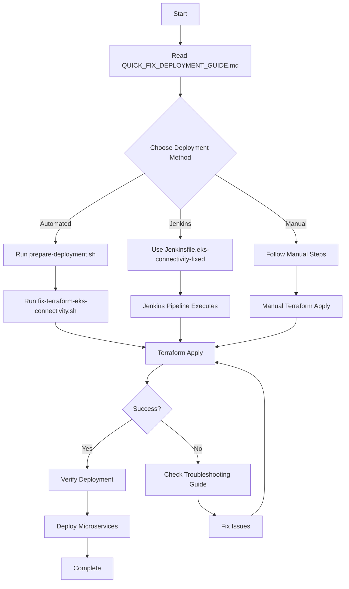

# 🔧 EKS Connectivity Fix - Applied Successfully!

## 🎯 What Was the Problem?

You encountered timeout errors when Terraform tried to create Kubernetes resources:

```
Error: Post "https://...eks.amazonaws.com/api/v1/namespaces": dial tcp 172.31.10.79:443: i/o timeout
Error: context deadline exceeded
```

**Root Cause**: Your EC2 instance (where Jenkins/Terraform runs) couldn't reach the EKS cluster API endpoint.

---

## ✅ What's Been Fixed?

All necessary fixes have been applied to your `infraeks-master` project:

### 1. 🔒 Security Configuration
- Added security group rule to allow EC2 → EKS cluster API communication
- VPC CIDR can now access cluster endpoint on port 443

### 2. ⏱️ Timeout Configuration
- Extended timeouts for Kubernetes resources (5-10 minutes)
- Added proper wait flags for Helm deployments
- Prevents premature timeout failures

### 3. 🔑 Authentication Enhancement
- Improved Kubernetes provider with AWS CLI exec auth
- Better token refresh and retry logic
- More reliable from EC2 instances

### 4. 🤖 Automation Scripts
- **Quick Fix Script**: Automated troubleshooting and fix application
- **Jenkins Wrapper**: Production-ready Jenkins deployment script
- **Preparation Script**: Environment validation and setup

### 5. 📚 Documentation
- Comprehensive troubleshooting guide
- Quick reference deployment guide
- Step-by-step verification procedures

---

## 🚀 How to Use the Fix

### Option 1: Quick Automated Fix (Fastest)

```bash
# 1. Prepare environment
chmod +x prepare-deployment.sh
./prepare-deployment.sh

# 2. Run the automated fix
cd terraform
./fix-terraform-eks-connectivity.sh

# 3. Deploy infrastructure
terraform apply -var-file=environments/dev.tfvars
```

### Option 2: Jenkins Pipeline (Recommended for CI/CD)

**Use the improved Jenkinsfile:**

```bash
# Replace your Jenkinsfile
cp Jenkinsfile.eks-connectivity-fixed Jenkinsfile

# Commit and push
git add .
git commit -m "Applied EKS connectivity fixes"
git push origin mainbranch

# Run Jenkins pipeline
# Set TERRAFORM_ACTION = apply
# Set USE_WRAPPER_SCRIPT = true
```

### Option 3: Manual Deployment

Follow the detailed steps in:
📚 **[QUICK_FIX_DEPLOYMENT_GUIDE.md](QUICK_FIX_DEPLOYMENT_GUIDE.md)**

---

## 📋 Files Overview

### 🔴 Modified Files (Core Fixes)

| File | Purpose |
|------|----------|
| `terraform/provider.tf` | Enhanced Kubernetes/Helm provider authentication |
| `terraform/modules/eks/main.tf` | Added security group rule for cluster access |
| `terraform/modules/microservices/main.tf` | Extended timeouts for namespace/SA creation |
| `terraform/modules/aws-load-balancer-controller/main.tf` | Extended timeouts for Helm deployment |

### 🟢 New Files (Tools & Documentation)

| File | Purpose |
|------|----------|
| 📚 `QUICK_FIX_DEPLOYMENT_GUIDE.md` | **START HERE** - Quick reference guide |
| 🔧 `terraform/TERRAFORM_EKS_CONNECTIVITY_FIX.md` | Comprehensive troubleshooting guide |
| 🚀 `terraform/fix-terraform-eks-connectivity.sh` | Automated fix script |
| ⚙️ `scripts/jenkins-terraform-wrapper.sh` | Jenkins deployment wrapper |
| 📑 `Jenkinsfile.eks-connectivity-fixed` | Improved Jenkins pipeline |
| 🛠️ `prepare-deployment.sh` | Environment preparation script |
| 📝 `EKS_CONNECTIVITY_FIX_README.md` | This file |

---

## 📈 Deployment Flow



---

## 🔍 Quick Verification

After deployment, run these commands to verify:

```bash
# Update kubeconfig
aws eks update-kubeconfig --name meracommerce-dev-cluster --region us-east-1

# Check cluster
kubectl cluster-info
kubectl get nodes

# Check namespaces
kubectl get namespaces | grep -E 'order|catalog|customer'

# Check service accounts
kubectl get sa -A | grep -E 'order-sa|catalog-sa|customer-sa'

# Check Load Balancer Controller
kubectl get pods -n kube-system | grep aws-load-balancer-controller
```

**Expected Results:**
- ✅ 3 namespaces: order-service-ns, catalog-service-ns, customer-service-ns
- ✅ 3 service accounts with IRSA annotations
- ✅ AWS Load Balancer Controller running
- ✅ Nodes in Ready state

---

## 🐛 Common Issues & Solutions

### Issue 1: "kubectl: command not found"

```bash
curl -LO "https://dl.k8s.io/release/$(curl -L -s https://dl.k8s.io/release/stable.txt)/bin/linux/amd64/kubectl"
chmod +x kubectl
sudo mv kubectl /usr/local/bin/
```

### Issue 2: "Cannot connect to cluster"

**Check security groups:**
```bash
# Run the automated fix script
cd terraform
./fix-terraform-eks-connectivity.sh
```

**Or manually add rule:**
```bash
CLUSTER_SG=$(aws eks describe-cluster --name meracommerce-dev-cluster --region us-east-1 --query 'cluster.resourcesVpcConfig.clusterSecurityGroupId' --output text)
VPC_CIDR=$(aws ec2 describe-vpcs --filters "Name=isDefault,Values=true" --region us-east-1 --query 'Vpcs[0].CidrBlock' --output text)
aws ec2 authorize-security-group-ingress --group-id $CLUSTER_SG --protocol tcp --port 443 --cidr $VPC_CIDR --region us-east-1
```

### Issue 3: "Resources already exist"

**Import existing resources:**
```bash
cd terraform
terraform import module.order_service.kubernetes_namespace.microservice order-service-ns
terraform import module.catalog_service.kubernetes_namespace.microservice catalog-service-ns
terraform import module.customer_service.kubernetes_namespace.microservice customer-service-ns
```

### Issue 4: Still getting timeouts

📖 **See detailed troubleshooting**: `terraform/TERRAFORM_EKS_CONNECTIVITY_FIX.md`

---

## 📚 Documentation Index

### Quick Reference
1. **🎯 Start Here**: [QUICK_FIX_DEPLOYMENT_GUIDE.md](QUICK_FIX_DEPLOYMENT_GUIDE.md)
2. **🔧 Troubleshooting**: [terraform/TERRAFORM_EKS_CONNECTIVITY_FIX.md](terraform/TERRAFORM_EKS_CONNECTIVITY_FIX.md)
3. **🏛️ Architecture**: [architecture-diagram.md](architecture-diagram.md)

### Implementation Guides
4. **🛠️ General Implementation**: [IMPLEMENTATION_GUIDE.md](IMPLEMENTATION_GUIDE.md)
5. **🕶️ Microservices Architecture**: [MICROSERVICES_DEPLOYMENT_ARCHITECTURE.md](MICROSERVICES_DEPLOYMENT_ARCHITECTURE.md)

### Scripts
6. **🚀 Automated Fix**: [terraform/fix-terraform-eks-connectivity.sh](terraform/fix-terraform-eks-connectivity.sh)
7. **⚙️ Jenkins Wrapper**: [scripts/jenkins-terraform-wrapper.sh](scripts/jenkins-terraform-wrapper.sh)
8. **🛠️ Preparation**: [prepare-deployment.sh](prepare-deployment.sh)

---

## ✨ Next Steps After Successful Deployment

1. **Verify Infrastructure**
   - Run verification commands above
   - Check all resources are healthy

2. **Deploy Microservices**
   ```bash
   # Order Service
   kubectl apply -f k8s-manifests/order-service/deployment.yaml
   
   # Catalog Service
   kubectl apply -f k8s-manifests/catalog-service/deployment.yaml
   
   # Customer Service
   kubectl apply -f k8s-manifests/customer-service/deployment.yaml
   ```

3. **Configure Ingress**
   ```bash
   kubectl apply -f k8s-manifests/ingress.yaml
   ```

4. **Set Up Monitoring**
   - CloudWatch Container Insights
   - Prometheus + Grafana
   - Log aggregation

5. **Configure Auto-scaling**
   - Horizontal Pod Autoscaler
   - Cluster Autoscaler

---

## 📊 What's Deployed?

### Infrastructure
- ✅ **EKS Cluster**: meracommerce-dev-cluster (Kubernetes 1.28+)
- ✅ **Node Group**: t3.medium instances (2-4 nodes, auto-scaling)
- ✅ **Networking**: Private VPC with public subnets
- ✅ **Security**: RBAC, Network Policies, IRSA

### Kubernetes Resources
- ✅ **Namespaces**: 3 microservice namespaces
- ✅ **Service Accounts**: With IAM role annotations (IRSA)
- ✅ **RBAC**: Roles and RoleBindings per service
- ✅ **Network Policies**: Inter-service communication rules
- ✅ **Resource Quotas**: CPU, memory, pod limits

### AWS Resources
- ✅ **IAM Roles**: IRSA roles for each microservice
- ✅ **IAM Policies**: S3, DynamoDB, SQS, Secrets Manager access
- ✅ **Security Groups**: Cluster and node security groups
- ✅ **Load Balancer Controller**: For ALB/NLB ingress

---

## 🔒 Security Features

- 🔐 **RBAC**: Role-based access control enabled
- 🚪 **Network Policies**: Namespace-level traffic restrictions
- 🎭 **IRSA**: Secure AWS resource access without credentials
- 🔒 **Encryption**: EBS volumes encrypted at rest
- 🌐 **Private Networking**: Private VPC with controlled egress
- 📊 **Resource Limits**: Quotas to prevent resource exhaustion

---

## 📧 Support

If you encounter issues not covered in the documentation:

1. 🔍 Check `DEPLOYMENT_SUMMARY.txt` (auto-generated)
2. 📚 Read `terraform/TERRAFORM_EKS_CONNECTIVITY_FIX.md`
3. 🔧 Run `terraform/fix-terraform-eks-connectivity.sh`
4. 📝 Review Terraform logs: `TF_LOG=DEBUG terraform apply`

---

## ✅ Success Checklist

Before proceeding to microservice deployment:

- [ ] Cluster is running: `aws eks describe-cluster --name meracommerce-dev-cluster`
- [ ] Nodes are ready: `kubectl get nodes`
- [ ] Namespaces created: `kubectl get ns | grep service-ns`
- [ ] Service accounts exist: `kubectl get sa -A`
- [ ] IRSA annotations present: `kubectl describe sa -n order-service-ns`
- [ ] Load Balancer Controller running: `kubectl get pods -n kube-system`
- [ ] No errors in logs: `kubectl logs -n kube-system <pod-name>`

---

**🎉 Congratulations! Your EKS infrastructure is now properly configured and ready for deployment!**

---

**Last Updated**: 2026-08-28  
**Version**: 1.0.0  
**Status**: ✅ Fixes Applied - Ready for Deployment
