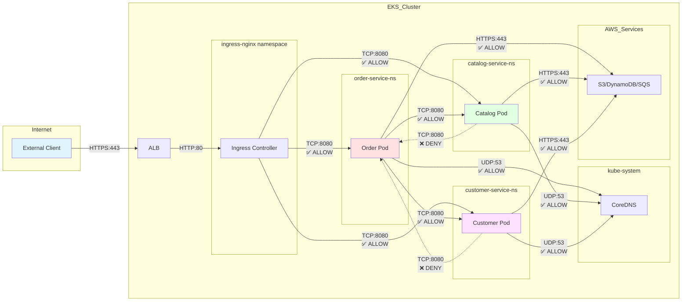
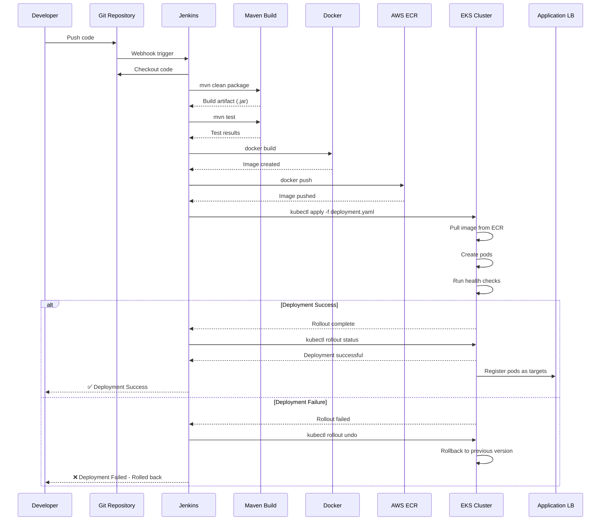
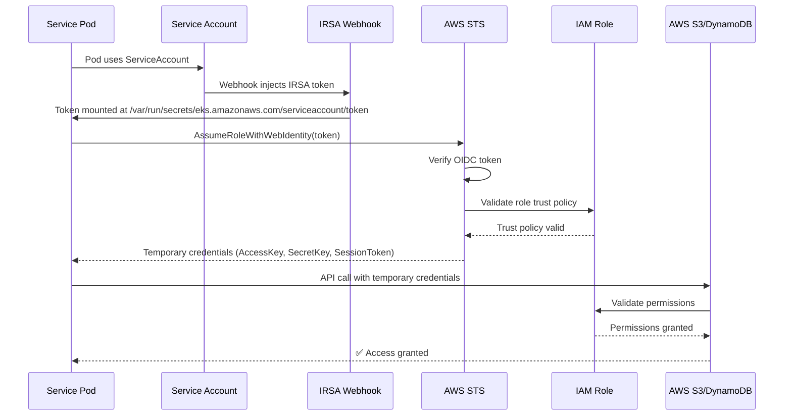
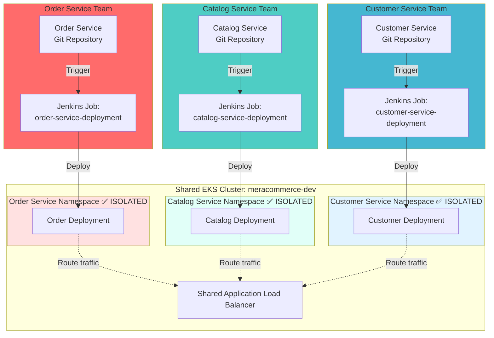

# Multi-Microservices Architecture Diagram

## High-Level Architecture

```mermaid
graph TB
    subgraph Internet
        Users[Users/API Clients]
    end
    
    subgraph AWS[AWS Cloud - us-east-1]
        subgraph VPC[Default VPC]
            ALB[Application Load Balancer<br/>internet-facing]
            
            subgraph EKS[EKS Cluster: meracommerce-dev]
                subgraph ControlPlane[Control Plane]
                    API[Kubernetes API Server]
                end
                
                subgraph Nodes[Node Group - t3.medium x2]
                    subgraph NS1[Namespace: order-service-ns]
                        OrderPod1[Order Service Pod 1]
                        OrderPod2[Order Service Pod 2]
                        OrderSvc[Service: order-service<br/>ClusterIP:8080]
                        OrderSA[ServiceAccount: order-sa]
                    end
                    
                    subgraph NS2[Namespace: catalog-service-ns]
                        CatalogPod1[Catalog Service Pod 1]
                        CatalogPod2[Catalog Service Pod 2]
                        CatalogSvc[Service: catalog-service<br/>ClusterIP:8080]
                        CatalogSA[ServiceAccount: catalog-sa]
                    end
                    
                    subgraph NS3[Namespace: customer-service-ns]
                        CustomerPod1[Customer Service Pod 1]
                        CustomerPod2[Customer Service Pod 2]
                        CustomerSvc[Service: customer-service<br/>ClusterIP:8080]
                        CustomerSA[ServiceAccount: customer-sa]
                    end
                    
                    subgraph SysNS[Namespace: kube-system]
                        ALBController[AWS LB Controller]
                        CoreDNS[CoreDNS]
                    end
                end
                
                Ingress[Ingress Resource<br/>Path-based Routing]
            end
        end
        
        subgraph IAM[IAM]
            OrderRole[IAM Role: order-service-irsa]
            CatalogRole[IAM Role: catalog-service-irsa]
            CustomerRole[IAM Role: customer-service-irsa]
            ALBRole[IAM Role: alb-controller]
        end
        
        subgraph Resources[AWS Resources]
            S3[S3 Buckets]
            DDB[DynamoDB Tables]
            SQS[SQS Queues]
            Secrets[Secrets Manager]
            ECR[ECR Repositories]
        end
    end
    
    subgraph CICD[CI/CD]
        Jenkins[Jenkins]
        OrderPipeline[Order Service Pipeline]
        CatalogPipeline[Catalog Service Pipeline]
        CustomerPipeline[Customer Service Pipeline]
    end
    
    %% User flow
    Users -->|HTTPS| ALB
    ALB -->|/api/orders| Ingress
    ALB -->|/api/catalog| Ingress
    ALB -->|/api/customers| Ingress
    
    %% Ingress routing
    Ingress -->|route| OrderSvc
    Ingress -->|route| CatalogSvc
    Ingress -->|route| CustomerSvc
    
    %% Service to Pods
    OrderSvc --> OrderPod1
    OrderSvc --> OrderPod2
    CatalogSvc --> CatalogPod1
    CatalogSvc --> CatalogPod2
    CustomerSvc --> CustomerPod1
    CustomerSvc --> CustomerPod2
    
    %% Inter-service communication
    OrderPod1 -.->|HTTP| CatalogSvc
    OrderPod1 -.->|HTTP| CustomerSvc
    
    %% IRSA
    OrderSA -->|assumes| OrderRole
    CatalogSA -->|assumes| CatalogRole
    CustomerSA -->|assumes| CustomerRole
    ALBController -->|assumes| ALBRole
    
    %% AWS resource access
    OrderRole -->|access| S3
    OrderRole -->|access| DDB
    OrderRole -->|access| SQS
    CatalogRole -->|access| S3
    CatalogRole -->|access| DDB
    CustomerRole -->|access| DDB
    CustomerRole -->|access| Secrets
    
    %% ALB management
    ALBController -->|manages| ALB
    ALBController -->|watches| Ingress
    
    %% CI/CD
    Jenkins --> OrderPipeline
    Jenkins --> CatalogPipeline
    Jenkins --> CustomerPipeline
    
    OrderPipeline -->|build & push| ECR
    OrderPipeline -->|deploy| OrderPod1
    CatalogPipeline -->|build & push| ECR
    CatalogPipeline -->|deploy| CatalogPod1
    CustomerPipeline -->|build & push| ECR
    CustomerPipeline -->|deploy| CustomerPod1
    
    %% DNS
    OrderPod1 -->|DNS lookup| CoreDNS
    CatalogPod1 -->|DNS lookup| CoreDNS
    CustomerPod1 -->|DNS lookup| CoreDNS
    
    classDef aws fill:#FF9900,stroke:#232F3E,stroke-width:2px,color:#fff
    classDef k8s fill:#326CE5,stroke:#fff,stroke-width:2px,color:#fff
    classDef service fill:#13aa52,stroke:#fff,stroke-width:2px,color:#fff
    classDef cicd fill:#D24939,stroke:#fff,stroke-width:2px,color:#fff
    
    class ALB,IAM,Resources,S3,DDB,SQS,Secrets,ECR aws
    class EKS,Nodes,NS1,NS2,NS3,SysNS,Ingress k8s
    class OrderSvc,CatalogSvc,CustomerSvc,ALBController service
    class Jenkins,OrderPipeline,CatalogPipeline,CustomerPipeline cicd
```



## Network Policy Flow



## CI/CD Pipeline Flow



## IRSA (IAM Roles for Service Accounts) Flow



## Deployment Architecture by Team



## Resource Hierarchy

```
AWS Account
└── Region: us-east-1
    ├── VPC: Default VPC
    │   ├── Subnets: us-east-1a, us-east-1b, us-east-1c
    │   └── Security Groups
    │
    ├── EKS Cluster: meracommerce-dev
    │   ├── Control Plane (v1.31)
    │   │   └── OIDC Provider: oidc.eks.us-east-1.amazonaws.com/id/XXX
    │   │
    │   ├── Node Group: meracommerce-dev-node-group
    │   │   ├── Instance Type: t3.medium
    │   │   ├── Min: 1, Desired: 2, Max: 3
    │   │   └── AMI: Amazon Linux 2023
    │   │
    │   └── Namespaces
    │       ├── kube-system
    │       │   ├── ServiceAccount: aws-load-balancer-controller
    │       │   └── Deployment: aws-load-balancer-controller
    │       │
    │       ├── order-service-ns
    │       │   ├── ServiceAccount: order-sa
    │       │   ├── Deployment: order-service (replicas: 2)
    │       │   ├── Service: order-service (ClusterIP)
    │       │   ├── ConfigMap: order-service-config
    │       │   ├── Secret: order-service-secret
    │       │   ├── NetworkPolicy: order-service-netpol
    │       │   ├── ResourceQuota: order-service-quota
    │       │   └── LimitRange: order-service-limit-range
    │       │
    │       ├── catalog-service-ns
    │       │   └── (Same structure as order-service-ns)
    │       │
    │       └── customer-service-ns
    │           └── (Same structure as order-service-ns)
    │
    ├── IAM Roles
    │   ├── meracommerce-dev-order-service-irsa
    │   │   └── Trust Policy: OIDC Provider + order-sa
    │   ├── meracommerce-dev-catalog-service-irsa
    │   ├── meracommerce-dev-customer-service-irsa
    │   └── meracommerce-dev-aws-load-balancer-controller
    │
    ├── ECR Repositories
    │   ├── order-service
    │   ├── catalog-service
    │   └── customer-service
    │
    └── Elastic Load Balancers
        └── k8s-default-microser-XXX (ALB)
            ├── Target Group: order-service
            ├── Target Group: catalog-service
            └── Target Group: customer-service
```

---

**Legend:**
- ✅ ALLOW - Network policy allows traffic
- ❌ DENY - Network policy blocks traffic
- Solid arrows (→) - Direct communication
- Dashed arrows (-.→) - Conditional/restricted communication
